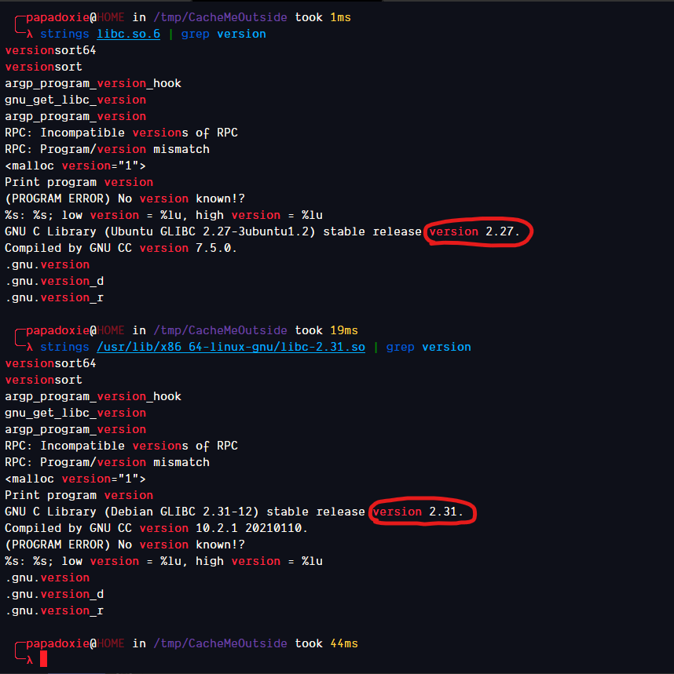

<< [Back to Home](https://papadoxie.github.io)

# Cache Me Outside
## Write-up of the PicoCTF Binary Exploitation Challenge

## Setup

3 files are provided to us for the challenge and the address
to the server is also provided.

Lets download the files and try to run the binary

We get a crash
This occurs because our linker is a newer version than the libc provided

We can fix this using pwninit which will automatically take care of this

Lets try running it now

Hmm, it still crashes  
Lets open the binary in Ghidra and take a look at whats going on

## Analysis

## Exploitation